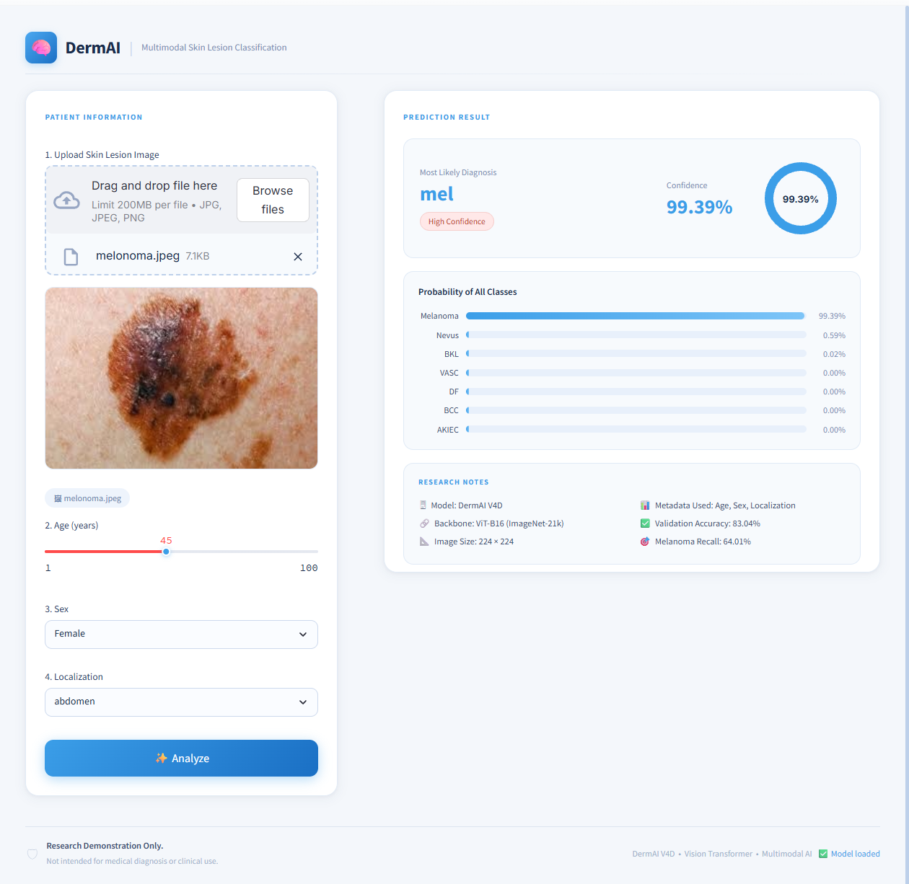

#  DermAI: Multimodal Skin Lesion Classification using Vision Transformers

<p align="center">
  
</p>

<p align="center">
  <b>A Vision Transformer (ViT-B16) based multimodal skin lesion classification system combining dermoscopic images with patient metadata.</b>
</p>

---

##  Overview

DermAI is a research-driven deep learning application for automated **7-class skin lesion classification** using the **HAM10000** dataset.

Unlike conventional image-only classifiers, DermAI integrates both:

*  Dermoscopic Images
*  Patient Metadata

  * Age
  * Sex
  * Lesion Localization

The application provides an intuitive Streamlit interface for image upload, metadata entry, prediction confidence, and probability visualization.

---

##  Features

* ✅ Vision Transformer (ViT-B16 Backbone)
* ✅ Multimodal Learning (Image + Metadata)
* ✅ 7 Skin Lesion Classes
* ✅ Interactive Streamlit Dashboard
* ✅ Confidence Distribution Visualization
* ✅ Clean and Modern User Interface

---

##  Dataset

* **Dataset:** HAM10000 (Human Against Machine with 10,000 Training Images)
* **Image Size:** 224 × 224
* **Metadata Used**

  * Age
  * Sex
  * Localization

---

##  Model Architecture

```text
Image
   │
ViT-B16 Backbone
   │
CLS Token
   │
───────────────┐
               │
Metadata Branch
(Dense → Dropout → Dense)
               │
───────────────┘
       │
 Concatenation
       │
 Dense Layer
       │
 Softmax (7 Classes)
```

---

##  Performance

| Metric             |    Value |
| ------------------ | -------: |
| Accuracy           |  **83%** |
| Weighted F1 Score  | **0.84** |
| Macro F1 Score     | **0.74** |
| Melanoma Precision | **0.56** |
| Melanoma Recall    | **0.67** |
| Melanoma F1        | **0.61** |

---

##  Supported Classes

* Melanoma
* Basal Cell Carcinoma (BCC)
* Benign Keratosis (BKL)
* Actinic Keratosis (AKIEC)
* Dermatofibroma (DF)
* Vascular Lesion (VASC)
* Melanocytic Nevus (NV)

---

##  Installation

Clone the repository

```bash
git clone https://github.com/chandu2006-git/cancer-detection-model.git
```

Install dependencies

```bash
pip install -r requirements.txt
```

Run the application

```bash
streamlit run app.py
```

---

##  Repository Structure

```text
DermAI
│
├── assets/
│   ├── dashboard.png
│   └── sample.jpg
│
├── configs/
│   └── class_mapping.json
│
├── utils/
│   ├── image_preprocessing.py
│   ├── inference.py
│   └── metadata_encoder.py
│
├── app.py
├── style.css
├── requirements.txt
└── README.md
```

---

##  Deployment Note

The evaluation metrics reported above correspond to experiments performed on the HAM10000 benchmark dataset.

The Streamlit application is provided as a research demonstration of the multimodal inference pipeline. It is intended for educational and research purposes only and **must not be used for clinical diagnosis or medical decision-making**.

---

##  Research

This repository focuses on the deployment component of the DermAI project.

The complete research notebook, training pipeline, experiments, and evaluation are available in the published notebook.

---

##  Author

**Chandra sekhar**

Deep Learning • Computer Vision • Medical AI

---

##  License

This project is released under the MIT License.
